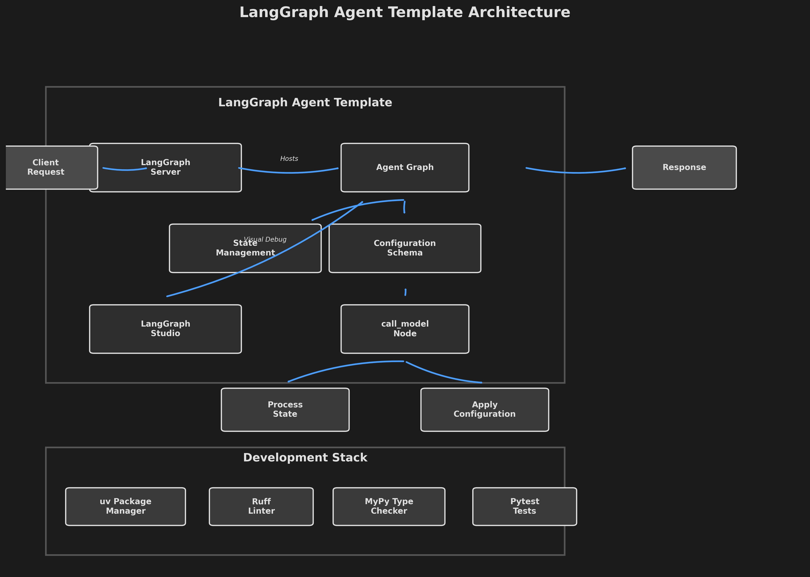

# LARPy - Ethereum Arbitrage Bot

[](https://github.com/langchain-ai/new-langgraph-project/actions/workflows/unit-tests.yml)
[](https://github.com/langchain-ai/new-langgraph-project/actions/workflows/integration-tests.yml)

LARPy is an Ethereum DEX arbitrage detection bot built with LangGraph. This agent analyzes price differences across major DEXs (Uniswap V3, SushiSwap, Curve Finance) to identify profitable arbitrage opportunities for popular tokens.

## Architecture



## Overview

LARPy (LangGraph ARbitrage Python bot) is a proof-of-concept that demonstrates how to build a crypto trading agent using LangGraph. The bot:

- **Monitors Multiple DEXs**: Fetches real-time prices from Uniswap V3, SushiSwap, and Curve Finance
- **Identifies Arbitrage**: Automatically detects profitable price discrepancies between exchanges
- **Calculates Profits**: Factors in gas costs and provides net profit estimates
- **Focuses on Major Tokens**: Works with well-audited tokens like ETH, USDC, USDT, WBTC, UNI, AAVE
- **Provides Clear Strategies**: Generates step-by-step execution plans for identified opportunities

## Features

### Blockchain Tools
- Check ETH and ERC-20 token balances
- Monitor current gas prices
- Estimate transaction costs

### DEX Price Tools
- **Uniswap V3**: Uses Quoter contract for accurate swap simulation
- **SushiSwap**: Direct pool queries via getReserves()
- **Curve Finance**: Supports stableswap (3pool) and crypto pools (ETH pairs)
- **Extended Support**: Placeholders for Fluid DEX and Maverick Protocol
- Compare prices across all DEXs simultaneously
- Supports popular pairs: ETH/USDC, ETH/USDT, WBTC/ETH, ETH/DAI, stETH/ETH

### Arbitrage Analysis
- Identify profitable opportunities above configurable thresholds
- Calculate expected profits after gas costs
- Generate formatted trading strategies
- Analyze multiple token pairs in batch

## Getting Started

### Prerequisites

- Python 3.11+
- [uv](https://docs.astral.sh/uv/) - Fast Python package manager (replaces pip)
- OpenAI API key (for the LLM agent)

### Installation

1. Clone the repository and install dependencies using uv:

```bash
cd path/to/test-agent
uv sync
```

2. Set up environment variables:

```bash
# Create .env file
echo "OPENAI_API_KEY=your-openai-api-key-here" > .env

# Optional: Add LangSmith for tracing
echo "LANGSMITH_API_KEY=your-langsmith-key" >> .env
```

3. (Optional) Configure custom RPC endpoints for better reliability:

```bash
# Add to .env for custom Ethereum RPC (default uses public endpoints)
echo "ETH_RPC_URL=https://your-eth-rpc-endpoint" >> .env
```

### Running the Agent

Start the LangGraph development server:

```bash
uv run langgraph dev
```

The server will start on `http://localhost:8123` with LangGraph Studio available for visual debugging.

### Testing the Arbitrage Bot

Once the server is running, you can interact with the bot through the LangGraph Studio UI or API. Here are example queries:

#### 1. Check current gas prices:
```
"What's the current gas price on Ethereum?"
```

#### 2. Compare prices across DEXs:
```
"Show me ETH/USDC prices on all major DEXs"
"Get DAI/USDC price on Curve"
"Check stETH/ETH price on Curve Finance"
```

#### 3. Find arbitrage opportunities:
```
"Find arbitrage opportunities for ETH/USDC, ETH/USDT, and WBTC/ETH pairs"
```

#### 4. Get a full arbitrage analysis:
```
"Analyze ETH/USDC for arbitrage opportunities and show me the potential profit for trading 10 ETH"
```

#### 5. Check token balances:
```
"What's the USDC balance for address 0x..."
```

### Example Arbitrage Detection Flow

1. The agent fetches prices from multiple DEXs
2. Identifies price discrepancies above the threshold (default 0.5%)
3. Calculates potential profit after gas costs
4. Provides a detailed execution strategy

Example output:
```
🎯 ARBITRAGE OPPORTUNITY FOUND!

Buy on: SushiSwap
Price: 1 ETH = 3,245.50 USDC

Sell on: Uniswap V3  
Price: 1 ETH = 3,262.75 USDC

Profit: 0.53%
Strategy: Buy ETH on SushiSwap, sell on Uniswap V3
Net profit after gas: 0.41% (assuming 0.01 ETH gas cost)
```

## Configuration System

LARPy uses a YAML-based configuration system with Pydantic validation for all static data:

- **`configs/chains.yaml`** - Blockchain networks and RPC endpoints
- **`configs/tokens.yaml`** - Token addresses, symbols, and decimals
- **`configs/dexes.yaml`** - DEX pools, contracts, and ABIs
- **`configs/arbitrage.yaml`** - Trading parameters and thresholds
- **`configs/models.yaml`** - LLM model settings

### Using Configuration

```python
from agent.config_loader import get_config

# Access configuration
config = get_config()
rpc_url = config.default_chain.rpc_url
min_profit = config.arbitrage.min_profit_percentage
```

## Customization & Extension

### Adding New DEXs

1. Add pool configurations to `configs/dexes.yaml`
2. Create new tools in `src/agent/tools/dex_prices.py`:

```python
@tool
def get_new_dex_price(from_token: str, to_token: str) -> str:
    """Get token price from New DEX."""
    config = get_config()
    # Use config for pool addresses, ABIs, etc.
```

### Adjusting Arbitrage Parameters

Edit `configs/arbitrage.yaml`:

```yaml
# Change minimum profit threshold
min_profit_percentage: 1.0  # Changed from 0.5%
gas_cost_estimate_eth: 0.015  # Adjust gas estimates
```

### Adding New Token Pairs

Add tokens to `configs/tokens.yaml`:

```yaml
NEW_TOKEN:
  address: "0x..."
  symbol: "NEW"
  name: "New Token"
  decimals: 18
  chain_id: 1
```

## Development

### Package Management with UV

This project uses [UV](https://docs.astral.sh/uv/) exclusively - a fast Rust-based Python package manager that replaces pip:

```bash
# Install dependencies (NOT pip install -r requirements.txt)
uv sync

# Add a new package
uv add <package-name>

# List installed packages
uv tree

# Run any command in the project environment
uv run <command>
```

### Running Tests

```bash
# Run all tests
uv run pytest

# Run unit tests only
uv run pytest tests/unit_tests/

# Run integration tests
uv run pytest tests/integration_tests/

# Or use Make targets (which use UV internally)
make test
make integration_tests
```

### Code Quality

```bash
# Run linting and formatting
make lint        # Runs ruff + mypy
make format      # Auto-formats code

# Or run directly with UV
uv run ruff check .
uv run ruff check --fix .
uv run mypy src/
```

### Working with LangGraph Studio

- **Hot reload**: Edit your graph code and changes are automatically applied
- **State debugging**: Edit past state and rerun from any point to debug specific nodes
- **Thread management**: Use the `+` button to create new threads with fresh state
- **Tracing**: Integrated with [LangSmith](https://smith.langchain.com/) for detailed execution traces

### Security Considerations

⚠️ **IMPORTANT**: This is a proof-of-concept. For production use:

1. **Never store private keys in code or environment variables**
2. **Use hardware wallets or secure key management systems**
3. **Implement proper slippage protection**
4. **Add MEV protection for transaction execution**
5. **Use private mempools or flashbots for sensitive transactions**
6. **Implement circuit breakers and position limits**
7. **Monitor for sandwich attacks**

### Known Limitations

- **Read-only**: Current implementation only detects opportunities, doesn't execute trades
- **Direct Contract Queries**: Uniswap V3 and SushiSwap use on-chain queries which require checksummed addresses
- **Gas Estimation**: Simple gas estimates may not reflect actual costs during high congestion
- **Limited Pools**: Only includes major token pairs; less liquid pairs not supported
- **No Aggregator**: Without 1inch, we only compare two DEXs instead of aggregated best prices

### Future Enhancements

- **Flashloan Integration**: Add tools for capital-free arbitrage using Aave/dYdX
- **Transaction Execution**: Implement secure transaction signing and submission
- **Real-time Monitoring**: WebSocket connections for live price feeds
- **Multi-hop Arbitrage**: Support complex paths like ETH → USDC → DAI → ETH
- **Cross-chain Arbitrage**: Add support for L2s and bridges
- **Analytics Dashboard**: Track historical performance and opportunities

<!--
Configuration auto-generated by `langgraph template lock`. DO NOT EDIT MANUALLY.
{
  "config_schemas": {
    "agent": {
      "type": "object",
      "properties": {}
    }
  }
}
-->
